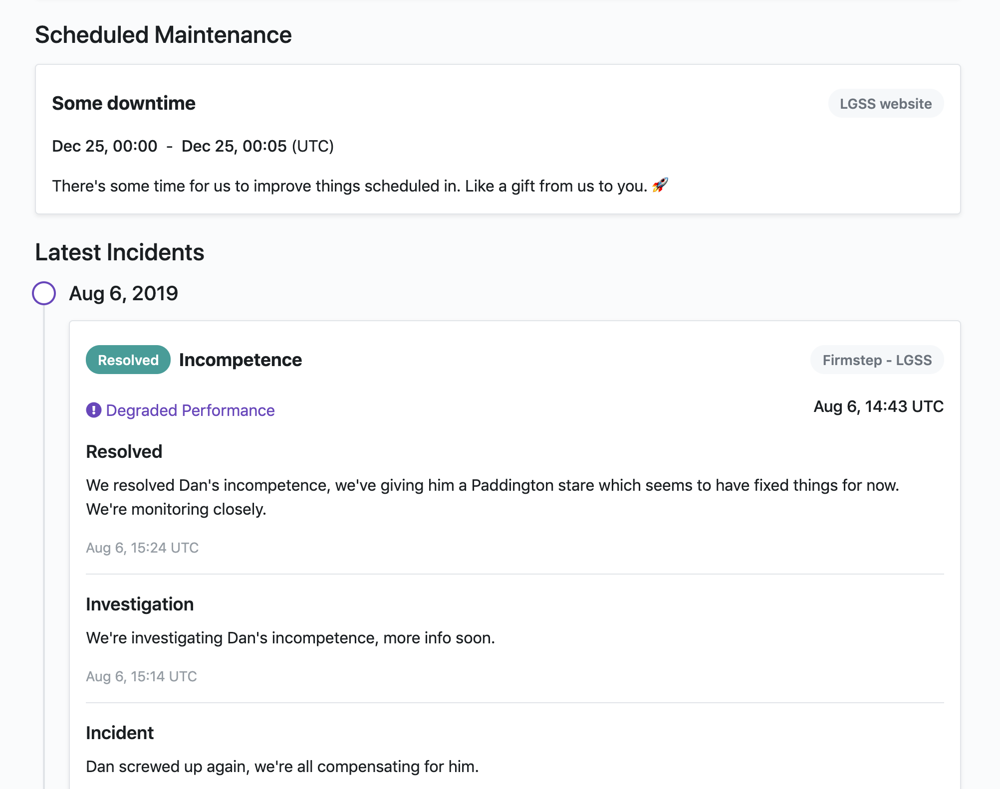

# S'Uptime
A simple public facing status and incident management app based on [Statusfy][statusfy-docs]

## Getting started
1. Install `npm` which includes `npx`
1. Clone this repo
1. Run `npm install`
1. Run `npm run dev`

Your dev server should run at `http://localhost:3000`

## Preview

## Editing guide
This uses [Statusfy][statusfy-docs] so refer to the [docs][statusfy-docs] for config options and settings.

[statusfy-docs]: https://docs.statusfy.co/